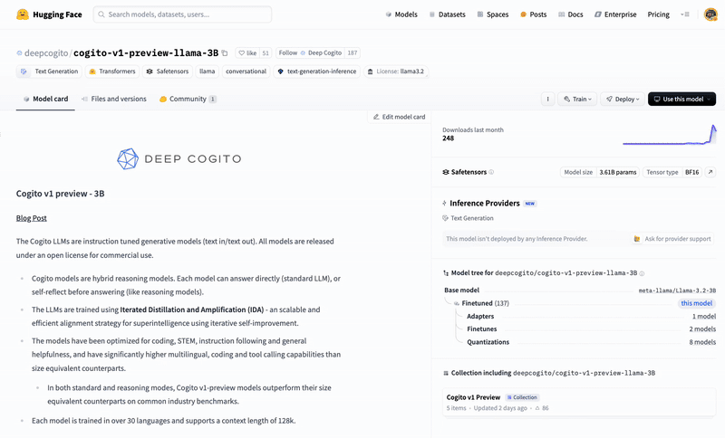

# Local LLM Streaming Tutorial

This repository provides an interactive tutorial (`local_llm_demo.ipynb`) demonstrating how to implement streaming text generation using local language models with the Hugging Face Transformers library.

## 🌟 Overview

The tutorial guides you through:

* Understanding the Hugging Face `pipeline` abstraction and its components (Model, Tokenizer, Pre/Postprocessors).
* Loading language models locally.
* Implementing real-time, token-by-token streaming using `TextIteratorStreamer`.
* Configuring generation parameters (temperature, top_p, etc.).
* Preparing chat inputs using message templates.
* Running generation in a separate thread for a responsive experience.
* Optionally using the `huggingface-cli` for faster model downloads.

## Prerequisites

* **Python**: Version 3.12 or higher.
* **pip3**: Python package installer.
* **uv**: Python package manager (will be installed automatically by `run.sh` if missing).
* **Git**: For cloning the repository.
* **(Optional) CUDA-enabled GPU**: For faster model inference (the code uses `device_map="auto"` to utilize GPU if available).
* **Windows Users**: Use Windows Subsystem for Linux (WSL) or Git Bash to run the bash scripts. The tutorial is designed for Unix-like environments.

## Model Download Methods

There are several ways to download and use models from the Hugging Face Hub:

### 1. Automatic Download via Pipeline (Default Method)

By default, the `pipeline()` function automatically downloads models when you first use them:

```python
from transformers import pipeline
pipe = pipeline('text-generation', model='model_id')
```

**Pros:**
- Simple and requires no additional steps
- Handles all file dependencies automatically

**Cons:**
- Basic downloader with limited feedback
- Can be slower than alternative methods
- May fail silently behind proxies or with network issues

### 2. HuggingFace CLI Tool (Recommended)

The HuggingFace CLI tool offers a more robust download experience:

```bash
huggingface-cli download --repo-type model model_id
```

**Pros:**
- **Faster downloads**: Uses optimized downloading with multiple connections
- **Better error handling**: Clearer feedback and retry mechanisms
- **Explicit caching**: More control over where and how models are stored
- **Progress tracking**: Visual feedback on download progress
- **Offline usage**: Download once, use anywhere without internet connection

This command can be run from a terminal or directly in a notebook cell by prefixing it with `!`.

### 3. Manual Download via Web Browser

If you're behind a corporate proxy or firewall that blocks the HuggingFace Hub API or CLI tools, you may be able to manually download model files through a web browser:



1. **Navigate to the model page** on HuggingFace:
   * Go to `https://huggingface.co/<model_id>` (e.g., `https://huggingface.co/deepcogito/cogito-v1-preview-llama-3B`)
   * Click on the "Files and versions" tab

2. **Download required files**:
   * `config.json` - Model configuration
   * `tokenizer.json` - Tokenizer data
   * `tokenizer_config.json` - Tokenizer configuration
   * `*.bin` or `*.safetensors` files - Model weights (might be split into multiple files)
   * `special_tokens_map.json` (if available)
   * `generation_config.json` (if available)

3. **Create a directory for the model**:
   ```bash
   mkdir -p models/cogito-llama-3B  # Or any name you prefer
   ```

4. **Place downloaded files** in this directory:
   ```bash
   mv ~/Downloads/config.json models/cogito-llama-3B/
   mv ~/Downloads/*.safetensors models/cogito-llama-3B/
   # Move all other downloaded files similarly
   ```

5. **Update the model reference** in the notebook:
   * Instead of using the model ID from HuggingFace Hub, use the local path:
   ```python
   model_id = "./models/cogito-llama-3B"  # Path to your model directory
   ```

This simpler approach allows you to organize models in your own directory structure without worrying about HuggingFace's cache format.

## 🚀 Setup and Installation

1. **Clone the repository:**
   ```bash
   git clone <repository-url>
   cd <repository-directory>
   ```

2. **Create a `.env` file:**
   Create a file named `.env` in the project root. This file is used for environment variables.

   * **Hugging Face Token (Required for Gated Models):** If you plan to use models that require accepting terms of use (like Mistral models), log in to your Hugging Face account, accept the terms on the model's page, and add your API token to the `.env` file:
     ```dotenv
     HF_TOKEN=your_hugging_face_api_token_here
     ```
   * **Enable Faster Downloads (Optional):** To potentially speed up model downloads, you can enable the `hf_transfer` library by adding:
     ```dotenv
     HF_HUB_ENABLE_HF_TRANSFER=1
     ```

3. **Run the setup script:**
   This script will:
   * Check for `uv` and install it if necessary.
   * Create a Python virtual environment named `.pyenv` using `uv`.
   * Activate the virtual environment.
   * Install the required dependencies (including `jupyterlab`, `torch`, `transformers`, `python-dotenv`, etc.) using `uv pip install` based on `pyproject.toml`.

   ```bash
   chmod +x run.sh
   ./run.sh
   ```
   
   > **Note for Windows Users**: If using WSL, ensure you're in the Linux environment before running these commands. If using Git Bash, you might need to modify some commands or create a Windows-compatible batch file equivalent.

## ▶️ Running the Tutorial

The `run.sh` script, after completing the setup, will automatically launch Jupyter Lab with the tutorial notebook.

1. If the script isn't still running from the setup step, execute it again:
   ```bash
   ./run.sh
   ```
2. Jupyter Lab will open in your web browser (or provide a URL to copy/paste).
3. The `local_llm_demo.ipynb` notebook will be automatically opened.
4. Follow the instructions and run the cells interactively within the notebook.

## 📝 Tutorial Content (`local_llm_demo.ipynb`)

* **Introduction & Abstract**: Sets the stage for the tutorial.
* **Model Selection**: Allows choosing different models from the Hugging Face Hub.
* **Understanding the Pipeline**: Explains the core components.
* **Optional Model Download**: Details the benefits of using `huggingface-cli`.
* **Model Loading**: Code for initializing the pipeline.
* **Setting Up Streaming**: Implementing `TextIteratorStreamer`.
* **Preparing the Chat**: Formatting input messages.
* **Generation Parameters**: Configuring the model's output.
* **Running the Generation**: Executing the streaming generation in a thread.
* **Example Queries**: Ideas for experimenting with different prompts.
* **Process Overview**: A summary of how everything works together.

Enjoy exploring local LLM streaming! 